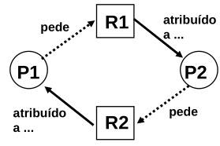

<!-- @import "note-style.less" -->

<!-- https://detexify.kirelabs.org/classify.html -->
<!-- https://shd101wyy.github.io/markdown-preview-enhanced/#/ -->

<link href="https://fonts.googleapis.com/css2?family=Handlee&display=swap" rel="stylesheet">

<!--

<table>
  <tr>
    <th></th>
    <th></th>
  </tr>
  <tr>
    <td></td>
    <td></td>
  </tr>
  <tr>
    <td></td>
    <td></td>
  </tr>
</table>

<table>
  <td></td>
  <td></td>
</table>

-->

# Deadlock

###### *Impasse; Bloqueio fatal; Bloqueio permanente* - bloqueio permanente de um conjunto de processos que competem por recursos do sistema ou comunicam entre si.

> Deadlock versus starvation:
> Deadlock (bloqueio fatal) :
>   * esperar indefinidamente por alguma coisa que não pode acontecer.
> 
> Starvation (inanição) :
> 
>   * esperar muito tempo por alguma coisa que pode nunca acontecer.

Vários processos, executando concorrentemente, competem pelos mesmos recursos e quando um processo detém um recurso, os outros têm de esperar.

<table>
<td style="text-align: center;">

2 processos utilizando
2 semáforos Mutex, S e Q
Acontece um deadlock se a ordem de execução for, por ex.: 
P1 - Wait(S), P2 - Wait(Q), P2 - Wait(S)

</td>
<td>

</td>
<table>

### Condições Necessárias para ocorrer deadlock

###### 4 condições tomadas em conjunto constituem condições necessárias e suficientes para um deadlock.

<table>

<td style="text-align: left">

* Exclusão mútua - Só um processo pode usar um recurso de cada vez.
* Retém e espera - Um processo pode deter recursos enquanto está à espera que lhe sejam atribuídos outros recursos.
* Não preempção dos recursos - Quando um processo detém um recurso só ele o pode libertar.
* Espera circular - O deadlock ocorre se e só se a condição de espera circular não tiver solução. A condição de espera circular não tem solução quando as 3 primeiras condições se verificam.

</td>

<td>

</td>

</table>

----

### Tratamento de deadlocks

#### Prevenir - Assegurar que pelo menos 1 das 4 condições necessárias não se verifica.

<table>

<tr>
<td>
Exclusão mútua
</td>

<td>
Solução: usar só recursos partilháveis ...!
</td>

<td>
Problema: certos recursos têm de ser usados com exclusão mútua.
</td>
</tr>

<tr>
<td>
Retém e espera
</td>

<td>

Solução: Garantir que quando um processo requisita um recurso não detém nenhum outro recurso:
* Requisitar todos os recursos antes de começar a executar, ou
* Requisitar os recursos incrementalmente, mas libertar os recursos que detém quando não conseguir requisitar os recursos de que precisa.

</td>

<td>

Problemas:
* Sub-utilização dos recursos.
* Necessidade de conhecimento prévio de todos os recursos necessários. (não faz sentido em sistemas interactivos)
* Possibilidade de inanição.

</td>
</tr>

<tr>
<td>
Não preempção de recursos
</td>

<td>

Solução: Permitir a preempção de recursos - Quando é negado um recurso a um processo, este deverá libertar todos os outros, ou o processo que detém esse recurso deverá libertá-lo.

</td>

<td>

Problema: só é aplicável a recursos cujo estado actual pode ser guardado e restaurado facilmente (ex.: memória e registos da CPU)

</td>
</tr>

<tr>
<td>
Espera circular
</td>

<td>

Solução: Protocolo para impedir espera circular; os vários tipos de recursos são ordenados e e os processos devem requisitá-los por essa ordem.

</td>

<td>

Problemas:
* Ineficiência devido à ordenação imposta aos recursos - os recursos têm de ser requisitados por uma certa ordem em vez de serem requisitados à medida que são precisos. Certos recursos são negados desnecessariamente.
* Difícil encontrar uma ordenação que funcione.

</td>
</tr>

</table>

#### Evitar - Não conceder recursos a um processo, se essa concessão for suscetível de conduzir a deadlock.

Permitir que aquelas condições se verifiquem, e decidir, perante cada pedido de recursos, se ele pode conduzir a um deadlock, caso os recursos sejam atribuídos. Se sim, negar a atribuição dos recursos pedidos.

Examinar dinamicamente o estado de alocação de recursos para assegurar que não vai ocorrer uma espera circular.

**Assegurar que o sistema nunca entra num estado inseguro (estado que pode conduzir a deadlock).**

Duas estratégias:

* Não começar a executar um processo se as suas necessidades, juntamente c/ as necessidades dos que já estão a correr, forem suscetíveis de conduzir a um deadlock. **Demasiado Restritiva**

* Não conceder um recurso adicional a um processo se essa concessão for suscetível de conduzir a um deadlock. **Algoritmo do Banqueiro**

> Algoritmo do Banqueiro
> * Vantagens: Menos restritivo do que a prevenção ; Não requer a requisição simultânea de todos os recursos necessários ; Não obriga à preempção dos recursos.
> * Dificuldades: Necessidade de conhecimento antecipado de todos os recursos necessários (utilidade prática limitada) ; Overhead necessário para detetar os estados seguros.

#### Deteção e Recuperação - Conceder sempre os recursos enquanto existirem disponíveis; periodicamente, verificar a existência de processos encravados e, se existirem, resolver a situação.

Os recursos são concedidos se estiverem disponíveis. | Periodicamente deteta-se a ocorrência de deadlocks | Se existir deadlock, aplica-se uma estratégia de recuperação.

* Deteção:
  * Sempre que é concedido um novo recurso $\rightarrow$ overhead elevado.
  * Com um período fixo.
  * Quando a utilização do processador é baixa.

* Recuperação:
  * Avisar o operador e deixar que seja ele a tratar do assunto.
  * O sistema recupera automaticamente - Abortando alguns processos envolvidos numa espera circular ou fazendo a preempção de alguns recursos.

*Mais detalhes no ppt - Solução do SO é a seguinte:*

#### Ignorar os deadlocks

Considera-se que é preferível que ocorra um deadlock, de vez em quando, do que estar sujeito ao overhead necessário para os evitar/detetar. O UNIX limita-se a negar os pedidos se não tiver os recursos disponíveis.

> Os deadlocks ocorrem essencialmente nos processos do utilizador, não nos processos do sistema. Alguns sistemas (ex: VMS) iniciam um temporizador sempre que um processo bloqueia à espera de um recurso. Se o pedido continuar bloqueado ao fim de um certo tempo, é então executado um algoritmo de deteção de deadlocks.