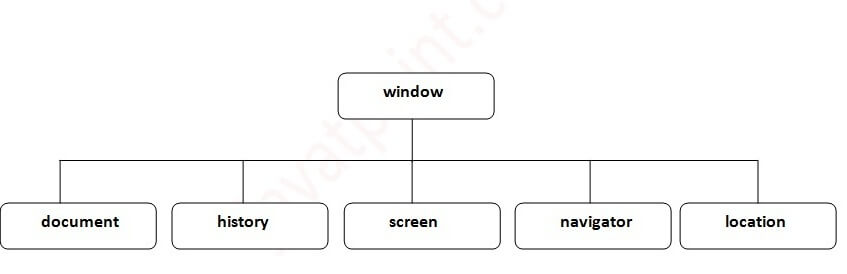
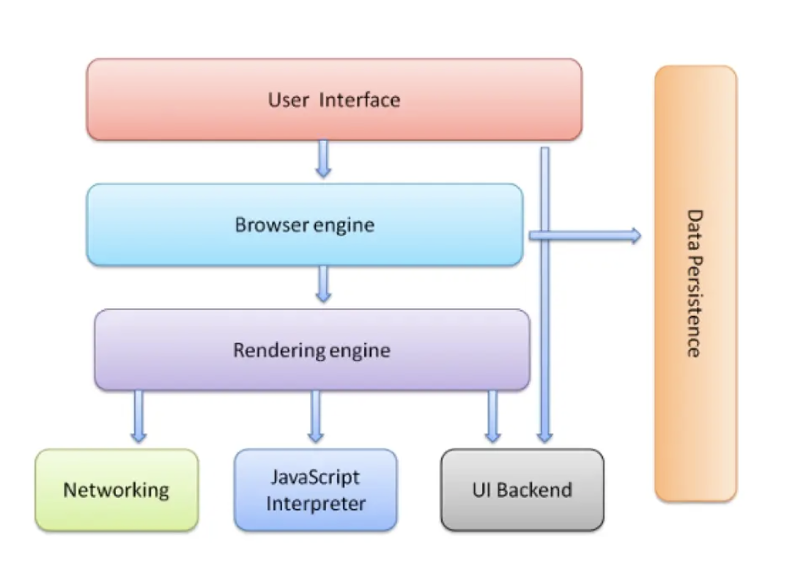

# Learning Objectives -  Browser Basics

1. ## Explain the difference between the BOM (browser object model) and the DOM(document object model).
  1. The DOM is the API used to access the elements inside the document
  2. The BOM is a larger representation of everything provided by the browser, including the current document
  
  - DOM(Document Object Model):
    - 
    - Interface that allows us to dynamically access and update the content, structure and style of a website
    - JS is the client-side scripting language that connects to the DOM in a browser
    - Defines HTML elements as objects and gives them properties, methods, and events
  
  - BOM(Browser Object Model):
    - 
    - Larger representation of everything provided by the browser, including the current document, location, history, frame, and any other functionality the browser may expose to JS. 
 
 
 

2. ## Given a diagram of all the different parts of the browser, identify each part.
  - 
 
    1. The User Interface
      - Everything the user interacts with, such as the address bar, back/forward buttons, bookmarks, etc..
      - Everything except page content
  
    2. Browser Engine
      - Manages interactions between the User Interface and the rendering engine
   
    3. Render Engine
      - Displays the requested page content
      - Parses HTML and uses CSS to build render tree and display content
      - Constructs the DOM(Document Object Model)
      - Not all browsers use the same rendering engine
        - Chrome(Blink), Safari(Webkit)

    4. Networking
      - Sends network calls like http requests to a server
      - Asks for images, docs, and other resources that compose the page

    5. JavaScript Interpreter
      - Parses and executes JS code
        - Chrome(V8), Safari(JavaScriptCore)

    6. UI Backend
      - Used for drawing basic widgets like checkboxes, inputs, etc..
      - Uses the UI methods of the underlying OS

    7. Data Storage
      - The persistence of data in the browser via:
         1. Cookies
           - Can be read client-side as well as server-side
           - Can only be 4kb in size
           - Purposes:
             - Session management - Logins, shopping carts, game scores
             - Personalization - User preferences, themes, and settings
             - Tracking - Recording and analyzing human behavior
         2. Web Storage:
           - Session Storage:
             - Maintains a separate storage area for each web address that is available for user for the duration their session, including reloads and restores
             - Data never transferred to the server
             - Storage limit larger than a cookie (5MB max)
           - Local Storage
             - Does the same thing as Session Storage, excepts persists even when the browser is closed and reopened
             - No expiration date and only gets cleared through JS, or clearing the browser cache / locally stored data
             - Maximum storage of all options
 
 
 

3. ## Use the Window API to change the innerHeight of a user's window.
   - [Code](./window-lo-3.js)
 
 
 

4. ## Identify the context of anonymous functions running in the browser.
    - The Window Object:
      - Represents an open window in a browser
      - The global object in the browser
      - The root of the DOM (contains document property used to reference DOM)
      - **Show in Browser**
 
 
 
 

5. ## Given a JS file and an HTML file, use a script tag to import the JS file and execute the code therein when all the elements on the page load.
   - [HTML](./import-loading-lo-5.js/index.html)
   - [JS](./import-loading-lo-5.js/index.js)

 
 
 
 

6. ## Explain the browser's main role in the request/response cycle.
   - The browser's main role is client-side interaction with the web through a series of requests and responses to servers.
     - **Request**:
       - Going to a file path in the browser makes a GET request for file
       - Navigating to a webpage in the browser makes a GET request for webpage
     - **Response**:
       - What we expect to receive back from a request
    - Parses HTML, CSS, and JS
    - Constructs and renders a DOM tree for the user(client)
  
7. ## Identify, examine, and delete cookies for a given website using the Chrome Developer Tools.
   1. Opens Chromes DevTools:
     - macOS shortcuts:
       - Option + ⌘ + J
       - Possibly F12
     - Windows shortcuts:
       - Shift + CTRL + J
       - Shift + CTRL + I
       - F12
   2. Navigate to `Application` tab
   3. Click `Cookies`

   - [Creating, Modifying, and Deleting Cookies in JavaScript](./cookies-lo-7.js/index.js)
