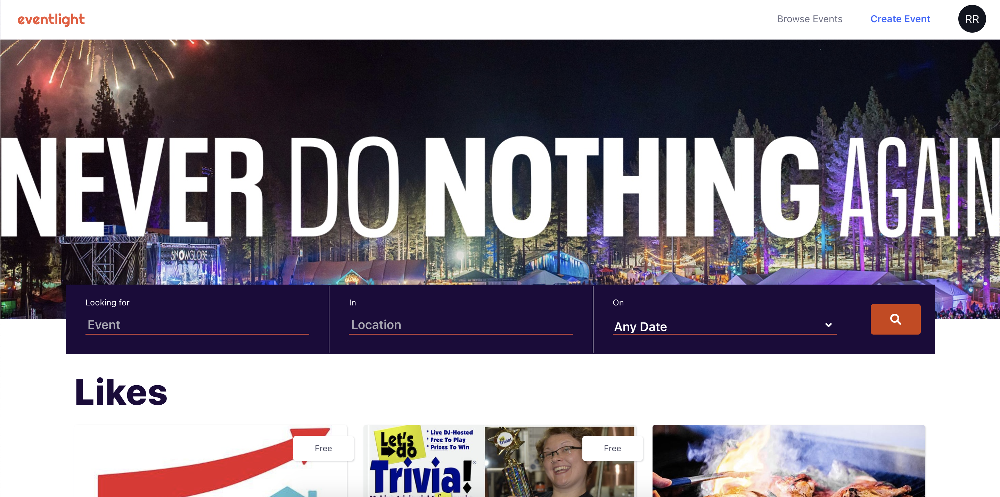

# Eventlight



[Eventlight](https://eventlight.herokuapp.com) is a clone of [Eventbrite](https://www.eventbrite.com/). Eventlight allows users create, bookmark, and register for events. Events are categorized by type and location.

## Background and Overview

Eventlight and is meant to demonstrate the efficient use of the MERN stack. This was done by emulating the design and functionality of Eventlight whilst using the MERN stack.

## The Team

The team consisted of:
**Gordy Cooper** ([github: gcoooop](https://github.com/gcoooop)), **Bryce Morgan** ([github: bamorgan13](https://github.com/bamorgan13)), and **Richard Robinson** ([github: richierob62](https://github.com/richierob62), [Twitter: @kindredcoder](https://twitter.com/kindredcoder))

## Functionality

- **User authentication:** Complete user signup and login authentication, including the persistence of the user's login status on browser refresh.

- **Search Functionality** Users can filter and search events by name, city, date range, event category, or event type

- **Event Management** Signed in users can create, edit and delete their own events.

- **Likes:** Signed in users can like and unlike events.

- **Registrations:** Signed in users can register (secure tickets) for events.

## Technologies

The project is built using the MERN stack:

- [MongoDB](https://www.mongodb.com/) - A document database stored on AWS
- [Express](https://expressjs.com/) - A web application framework for Node
- [React](https://reactjs.org/) - A component-based user interface library
- [Node](https://nodejs.org/en/) - A javascript runtime environment used to host the web server

Several additional libraries play supporting roles in the project:

Frontend:

- [axios](https://github.com/axios/axios) - A Promise based HTTP client
- [html-react-parser](https://github.com/remarkablemark/html-react-parser) - An HTML to React parser
- [jwt-decode](https://github.com/auth0/jwt-decode) - Decodes base64Url-encoded JWTs
- [moment](https://momentjs.com/) - A date parsing and manipulation library
- [react-calendar](https://github.com/wojtekmaj/react-calendar) - a calendar for React apps
- [react-datetime-picker](https://github.com/wojtekmaj/react-datetime-picker) - A datetime picker for React apps
- [react-quill](https://github.com/zenoamaro/react-quill) - Quill (a rich text editor) for React
- [react-redux](https://github.com/reduxjs/react-redux) - Redux bindings for React
- [react-router-dom](https://github.com/ReactTraining/react-router) - A client-side router for React
- [redux](https://redux.js.org/) - A state container
- [redux-thunk](https://github.com/reduxjs/redux-thunk) - A library to handle asynchronous actions whilst using redux

Backend:

- [bcryptjs](https://github.com/dcodeIO/bcrypt.js) - Password hashing function
- [body-parser](https://github.com/expressjs/body-parser) - Node body parsing middleware
- [jsonwebtoken](https://github.com/auth0/node-jsonwebtoken) - JSON Web Token implementation
- [lodash](https://github.com/lodash/lodash) - We use merge from this library for cloning nested objects
- [mongoose](https://github.com/Automattic/mongoose) - Object modeler for MongoDB database
- [passport](http://www.passportjs.org/) - Authentication middleware
- [passport-jwt](https://github.com/mikenicholson/passport-jwt) - JWT authentication strategy for passport
- [validator](https://github.com/skaterdav85/validatorjs) - Validation library

## Application Structure

### Frontend Routes

- / - main page
- /login - login page
- /register - register/signup page
- /events - listing of events
- /events/:eventId - details for a particular event
- /events/:eventId/edit - update event page
- /likes - listing of liked events
- /registrations - listing of user's event registrations
- /myevents/create - create a new event page

### Mongoose Models

```javascript
Category:
{
  name: { type: String, required: true, index: true }
}

Type:
{
	name: { type: String, required: true, index: true }
}

City:
{
  city: { type: String, required: true, index: true },
  state: { type: String, required: true, index: true }
}

Event:
{
  title: { type: String, required: true, index: true },
  description: { type: String, required: true },
  creator: { type: Schema.Types.ObjectId, ref: 'User'},
  organizer_name: { type: String, index: true },
  organizer_description: { type: String },
  start_date: { type: Date, required: true, index: true },
  end_date: { type: Date, required: true },
  location:
  {
    location_name: { type: String, index: true },
    location_address: { type: String },
    city: { type: Schema.Types.ObjectId, ref: 'City', required: false }
  },
  online_url: { type: String },
  price: { type: Number, required: true },
  category: { type: Schema.Types.ObjectId, ref: 'Category'},
  type: { type: Schema.Types.ObjectId, ref: 'Type'},
  capacity: { type: Number, required: true },
  image_url: { type: String, get: img_name => `${image_storage_root}${img_name}`},
  attendees: [{ type: Schema.Types.ObjectId, ref: 'User' }]
}

User:
{
  email: { type: String, required: true, index: true },
  full_name: { type: String },
  password: { type: String, require: true },
  liked_events: [{ type: Schema.Types.ObjectId, ref: 'Event' }],
  registrations: [{ type: Schema.Types.ObjectId, ref: 'Registration' }]
}

```

### Backend (API) Routes

- GET /api/users/current - the currently authenticated user
- GET /api/users/check_email - check to see if email exists on database
- POST /api/users/login - log in user
- POST /api/users/register - register a new user
- PATCH /api/users/:id - update user's name
- GET /api/events - events matching query paramaters
- GET /api/events/auto - events matching search string for dropdown
- GET /api/events/:id - specific event by id
- POST /api/events - create event
- PATCH /api/events/:id - update an event
- GET /api/cities/auto - cities matching search string for dropdown
- GET /api/likes - liked events for current user
- POST /api/likes - toggle like on event for current user
- GET /api/registrations - registrations for current user
- POST /api/registrations - create a registration for current user
- GET /api/categories - list of event categories
- GET /api/types - list of event types

## References

- https://simplemaps.com/data/us-cities
