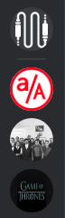
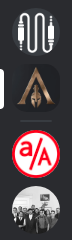
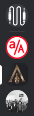

# Cha-aux

Cha-aux is an app that allows gamers to socialize with each other and communicate on the topics they care about.
 * Servers can be created by any user. Servers provide a general topic such as a game, console, company, or group.
 * Servers aren't limited to games! Create a server for your friends to hang out and communicate with each other.
 * Discover public servers created by others, join them, and join in on the conversation!
 
Vist [Cha-aux](https://cha-aux.herokuapp.com/) today!

### Technologies Used

Cha-aux is an app built on a:
  * Ruby on Rails backend
  * PostgresSQL database
  * React/Redux frontend rendering
  
### Key Features

* #### Server Discovery
Servers are the main feature of Cha-aux. They allow every user's experience to be unique by only serving content that they have subscribed to. By creating a public server, you can encourage others that are also interested in your topic to join in on your conversations.

Sometimes, however, you don't want just anybody to be able to walk in to your server. Maybe you have a group of friends that like to hang out and play random games together. By creating a private server, you can have a place to hang out and talk with just your group.


* #### Visiting vs. Joining Servers
A navigation bar with all of a user's joined servers is always present on the left side of the app when they are logged in. This feature allows for users to quickly swap between servers they have joined.

A user should also, however, be able to view a server without having to join it permanently. Perhaps they want to take a look around and see if it's an experience they want to participate in. When they are doing so, the server navigation bar should still be able to show them where they are, but only while they are viewing the server, reverting to their joined servers if they decide to navigate away without joining.

In order to accomplish this task, we have to check whether or not the user is on a server page and that they have not already joined the active server. We then create a new ServerNavItem component for the visited server and splice it in to the top of the nav bar, underneath the `Home` server.

```javascript
let joinServer;
if (
  this.state.currentServerId &&
  !discoveryPage &&
  !this.props.joinedServerIds.includes(this.state.currentServerId) &&
  this.props.fetchedServers[this.state.currentServerId]
) {
  const activeServer = this.props.fetchedServers[this.state.currentServerId];
  serverLis.splice(
  1,
  0,
  <ServerNavItem key={this.state.currentServerId} server={activeServer} activeServer="active" />
  );
  joinServer = <TempJoinServer server={activeServer} />;
}
```
    
We created a joinServer component that will allow the user to additionally join this server. This component is only created when visiting a server that has not yet been joined.

The changes to the nav bar can be seen in the example images below. First we see the standard nav bar with the home icon at the top, followed by joined server icons. Next we see a nav bar when we are visiting a server that we have not joined. The server icon is at the top of the nav bar, before any joined servers. If we navigate away from the server without joining, it will revert back to the original, as seen in the first image. Finally, after joining the server, the icon is placed in our joined servers section and will remain there when we navigate away from the server.

Standard Nav Bar:

Visiting Nav Bar:

Joined Nav Bar:

