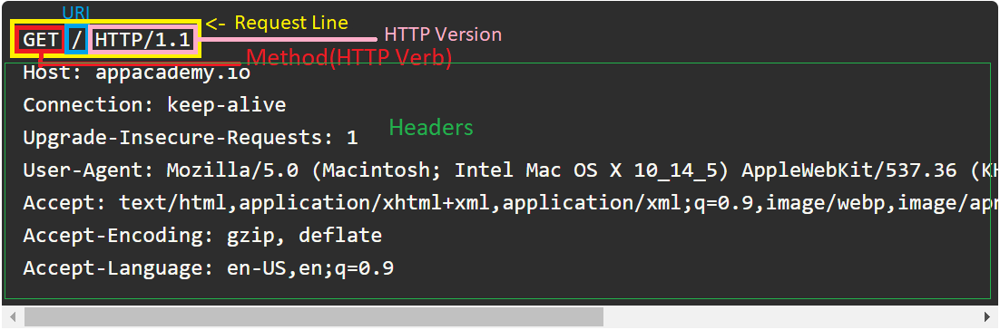
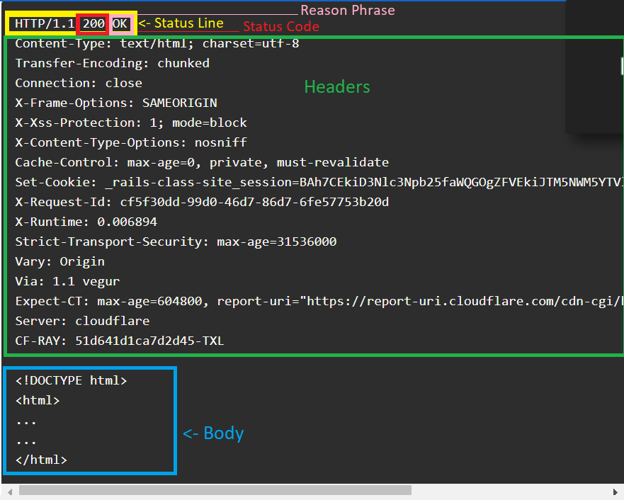

# HTTP Learning Objectives

- HTTP stands for HyperText Transfer Protocol
  - **HyperText**
    - Content that references other content
    - Can include images, video, or any other digital content
    - *Hyperlinks* are links to other resources
    - *HTML* is HyperText Markup Language
  - **Transfer Protocol**
    - Defines the expectations on both ends of the transfer
    - HTTP is always known as a *request/response protocol*
    - *protocol* - A set of guidelines surrounding the transmission of data, defining the process of data exchange
  - Works between *clients* and *servers*
    - *client* - Also known as the *user agent* and is typically your *web browser*
      - Clients send requests
    - *server* - Also known as the *origin* is the data provider
      - Servers send responses

## match the header fields of HTTP with a bank of definitions

- ### Requests

  - 
  - An HTTP request can have up to three parts
    1. *request-line*
    2. *headers*
    3. *body* - A `GET` request will never have a body.  
  - **Request-Line**
    - Begins with a *method token*(`GET`, `POST`, `PUT`, `PATCH`, `DELETE`, ...)
    - Second is a our *request URI*(Uniform Resource Identifier), which is an *identifier* of a specific resource, such as a page, book, or document
      - All *URLs* are *URIs*, but not all *URIs* are *URLs*
      - If the protocol(*`http`, `https`, `ftp`, ...*) is present or implied, it's a *URL*
    - **Examples** - `GET / HTTP/1.1`, `POST /users HTTP/2`, ...
  - **Common Headers**
    - **Host** - The name of the server or *domain name* to which we're making our request
    - **Content-Type** - Type of content found in the *body* of the HTTP Message
    - **Accept-** - What type of content will be accepted in the response
    - **User-Agent** - Displays information about which browser the request originated from.
    - **Referer** - Defines the URL you're coming from.  Will be seen when coming from another resource that contained a link you clicked
    - There are many more headers, but these are some of the most common ones.
  - **Body**
    - When we need to send data that doesn't fit in a header and is too complex for a *URI*, we place it in the body of our request
    - `GET` does not have a body.
    - *URL Encoding* - Formatting the data via the URL.  Common in web forms. `name=claire&age=29&iceCream=vanilla`

- ### Responses
  
  - 
  - **Status-Line**
    - Starts with *HTTP Version*: `HTTP/1.1`
    - Second is a *Status-Code*: `200`
    - last is a *Reason-Phrase*: `OK`
  - **Common Headers**
    - **Content-Type** - Type of content found in the *body* of the HTTP Message
    - **Location** - Useful for redirection
    - **Expires** - When the response should be considered stale, or no longer valid. Lets you *cache* responses
    - **Content-Disposition** - This header lets the client know how to display the response, and is specifically devoted to whether the response should be visible to the client or delivered as a download
    - **Set-Cookie** - This header sends data back to the client to set on the cookie, a set of key/value pairs associated with the server's domain.
    - There are many more response headers, but these are some of the most common ones.
  - **Body** - Assuming a successful request, the body of the response contains the resource you've requested. For a website, this means the HTML of the page you're accessing.
  
## matching HTTP verbs (GET, PUT, PATCH, POST, DELETE) to their common uses

- **GET** - The GET method requests a representation of the specified resource. Requests using GET should only retrieve data. Will not have a body.
- **POST** - The POST method is used to submit an entity to the specified resource, often causing a change in state or side effects on the server.
- **PUT** - The PUT method replaces all current representations of the target resource with the request payload.  Needs the whole resource
- **PATCH** - The PATCH method is used to apply partial modifications to a resource.
- **DELETE** - The DELETE method deletes the specified resource

## match common HTTP status codes (200, 302, 400, 401, 402, 403, 404, 500) to their meanings

- HTTP status codes are a numeric way of representing a server's response. Each code is a three-digit number accompanied by a short description.
  
1. **Informational responses (100–199)** - You'll rarely see these, but these let the client know that a request was received and provide any extra information from the server.
2. **Successful responses (200–299)** - Successful response codes indicate that the request has succeeded and the server is handling it
   1. **200 OK** - Request received and fulfilled. These usually come with a body that contains the resource you requested.
   2. **201 Created** - Your request was received and a new record was created as a result. You'll often see this response to POST requests.
3. **Redirects (300–399)** - These responses let the client know that there has been a change in the address, sometimes temporary, sometimes permanent
   1. **301 Moved Permanently** - The resource you requested is in a totally new location.
      1. This might be used if a webpage has changed domains, or if resources were reorganized on the server.
      2. Most clients will automatically process this redirect and send you to the new location, so you may not notice this response at all.
   2. **302 Found** - Similarly, to 301 Moved Permanently, this indicates that a resource has moved. However, this code is used to indicate a temporary move.
4. **Client errors (400–499)** - The status codes from 400 to 499, inclusive, indicate that there is a problem with the client's request.
   1. **400 Bad Request** - Whoops! The server received your request, but couldn't understand it.
      1. You might see a 400 Bad Request in response to a typo or accidentally truncated request.
      2. We often refer to these as *malformed requests*.
   2. **401 Unauthorized** - The resource you requested may exist, but you're not allowed to see it without authentication.
      1. These type of responses might mean one of two things:
         1. either you didn't log in yet
         2. you tried to log in but your credentials aren't being accepted.
   3. **403 Forbidden** - The resource you requested may exist, but you're not allowed to see it at all.
      1. This response code means this resource isn't accessible to you, even if you're logged in. You just don't have the correct permission to see it.
   4. **404 Not Found** - The resource you requested doesn't exist.
      1. You may see this response if you have a typo in your request (for example: going to appaccccademy.io)
      2. If you're looking for something that has been removed
5. **Server errors (500–599)** - These indicate that your request was formatted correctly, but that the server couldn't do what you asked due to an internal problem.
   1. **500 Internal Server Error** - Your request was received, and the server tried to process it, but something went awry!
      1. As you're learning to write your own servers, you'll often see a 500 Internal Server Error as your code fails unexpectedly.
   2. **504 Gateway Timeout** - Your request was received but the server didn't respond in a reasonable amount of time.
      1. Timeout errors can be tricky: your first instinct may be that your own connection is bad, but this code means the problem is likely on the server's side. You'll often see these when a server is no longer reachable (maybe due to an unexpected outage or power failure).

## send a simple HTTP request to google.com

- `GET / HTTP 1.1`

## write a very simple HTTP server using ‘http’ in node with paths that will result in the common HTTP status codes

- Refer to your project from Monday
