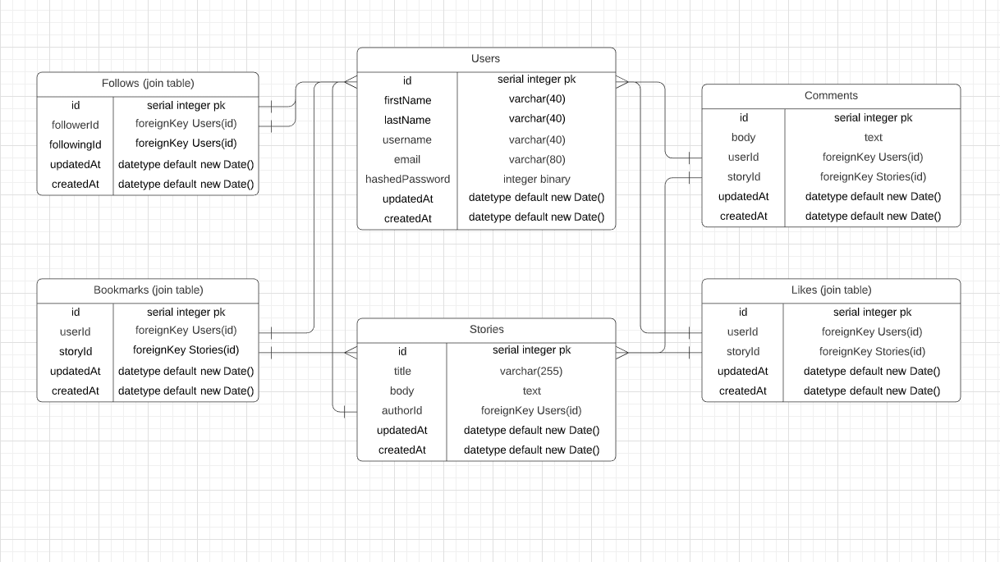

# Schema

## List of Tables:
* Users
* Stories
* Comments
* Follows (join table)
* Bookmarks (join table)
* Likes (join table)

 
 
 

| Users     | Data Type                   |
|-----------|-----------------------------|
| id        | serial integer pk           |
| firstName | varchar(40)                 |
| lastName  | varchar(40)                 |
| bio       | varchar(255)                |
| email     | varchar(80)                 |
| hashedPassword | integer binary         |
| updatedAt | datetype default new Date() |
| createdAt | datetype default new Date() |
 
 
 
 

| Stories   | Data Type                     |
|-----------|-------------------------------|
| id        | serial integer pk             |
| title     | varchar(200)                  |
| body      | text                          |
| userId    | **references Users(id) fk**   |
| updatedAt | datetype default new Date()   |
| createdAt | datetype default new Date()   |

 
 
 

| Topics    | Data Type                     |
|-----------|-------------------------------|
| id        | serial integer pk             |
| topic     | varchar(255)                  |
| updatedAt | datetype default new Date()   |
| createdAt | datetype default new Date()   |

 
 
 

| Tag       | Data Type                     |
|-----------|-------------------------------|
| id        | serial integer pk             |
| topicId   | **references Topics(id) fk**  |
| storyId   | **references Stories(id) fk** |
| updatedAt | datetype default new Date()   |
| createdAt | datetype default new Date()   |

| Watch     | Data Type                     |
|-----------|-------------------------------|
| id        | serial integer pk             |
| topicId   | **references Topics(id) fk**  |
| userId    | **references Users(id) fk**   |
| updatedAt | datetype default new Date()   |
| createdAt | datetype default new Date()   |

| Comments  | Data Type                     |
|-----------|-------------------------------|
| id        | serial integer pk             |
| body      | text                          |
| userId    | **references Users(id) fk**   |
| storyId   | **references Stories(id) fk** |
| updatedAt | datetype default new Date()   |
| createdAt | datetype default new Date()   |

 
 
 

| Likes     | Data Type                     |
|-----------|-------------------------------|
| id        | serial integer pk             |
| userId    | **references Users(id) fk**   |
| storyId   | **references Stories(id) fk** |
| updatedAt | datetype default new Date()   |
| createdAt | datetype default new Date()   |

 
 
 

| Follows     | Data Type                   |
|-------------|-----------------------------|
| id          | serial integer pk           |
| followerId  | **references Users(id) fk** |
| followingId | **references Users(id) fk** |
| updatedAt   | datetype default new Date() |
| createdAt   | datetype default new Date() |

 
 
 

| Bookmarks    | Data Type                     |
|--------------|-------------------------------|
| id           | serial integer pk             |
| userId       | **references Users(id) fk**   |
| storyId      | **references Stories(id) fk** |
| updatedAt    | datetype default new Date()   |
| createdAt    | datetype default new Date()   |
