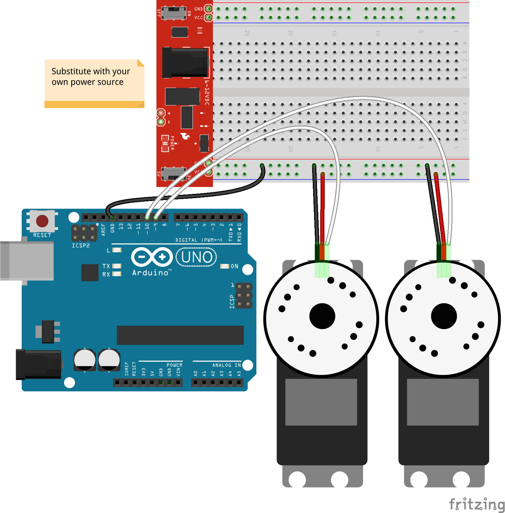

<!--remove-start-->

# Servo - Drive

<!--remove-end-->


##### Servos on pins 9 and 10


Servos connected to pins 9 and 10. Requires servos on pins that support PWM (usually denoted by ~).


<br>

Fritzing diagram: [docs/breadboard/servo-two.fzz](breadboard/servo-two.fzz)

&nbsp;


Run this example from the command line with:
```bash
node eg/servo-drive.js
```


```javascript
const {Board, Servo, Servos} = require("johnny-five");

const board = new Board();

board.on("ready", () => {

  let wheels = {};

  // Create two servos as our wheels
  wheels.left = new Servo({
    pin: 9,
    // `type` defaults to standard servo.
    // For continuous rotation servos, override the default
    // by setting the `type` here
    type: "continuous"

  });

  wheels.right = new Servo({
    pin: 10,
    // `type` defaults to standard servo.
    // For continuous rotation servos, override the default
    // by setting the `type` here
    type: "continuous",
    invert: true // one wheel mounted inverted of the other
  });

  // reference both together
  wheels.both = new Servos([wheels.left, wheels.right]);

  wheels.both.stop();

  // Add servos to REPL (optional)
  board.repl.inject({
    wheels
  });

  // Drive forwards
  // Note, cw() vs ccw() might me different for you
  // depending on how you mount the servos
  wheels.both.cw();

  // Stop driving after 3 seconds
  board.wait(3000, wheels.both.stop);

});

```


&nbsp;

<!--remove-start-->

## License
Copyright (c) 2012-2014 Rick Waldron <waldron.rick@gmail.com>
Licensed under the MIT license.
Copyright (c) 2015-2020 The Johnny-Five Contributors
Licensed under the MIT license.

<!--remove-end-->
