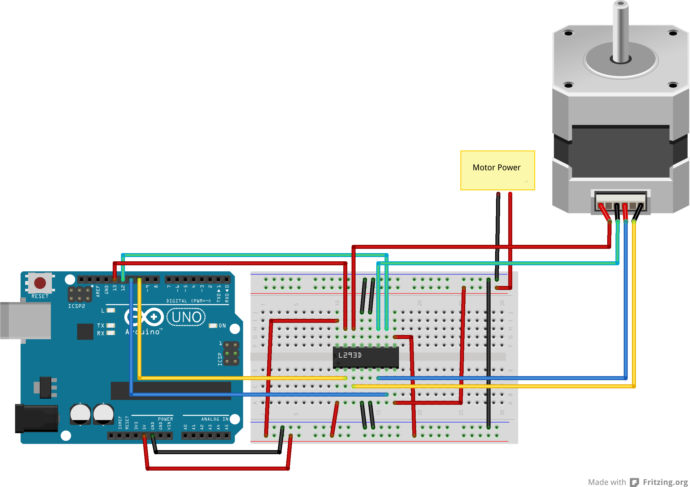

<!--remove-start-->

# Stepper - Four Wire

<!--remove-end-->


##### Breadboard for "Stepper - Four Wire"


<br>

Fritzing diagram: [docs/breadboard/stepper-four_wire.fzz](breadboard/stepper-four_wire.fzz)

&nbsp;


Run this example from the command line with:
```bash
node eg/stepper-four_wire.js
```


```javascript
const {Board, Stepper} = require("johnny-five");
const board = new Board();

board.on("ready", () => {
  /**
   * In order to use the Stepper class, your board must be flashed with
   * either of the following:
   *
   * - AdvancedFirmata https://github.com/soundanalogous/AdvancedFirmata
   * - ConfigurableFirmata https://github.com/firmata/arduino/releases/tag/v2.6.2
   *
   */

  const stepper = new Stepper({
    type: Stepper.TYPE.FOUR_WIRE,
    stepsPerRev: 200,
    pins: {
      motor1: 10,
      motor2: 11,
      motor3: 12,
      motor4: 13
    }
  });

  // set stepp[er to 180 rpm, CCW, with acceleration and deceleration
  stepper.rpm(180).direction(Stepper.DIRECTION.CCW).accel(1600).decel(1600);
  
  // make 10 full revolutions 
  stepper.step(2000, () => {
    console.log("done moving CCW");

    // once first movement is done, make 10 revolutions clockwise at previously
    //      defined speed, accel, and decel by passing an object into stepper.step
    stepper.step({
      steps: 2000,
      direction: Stepper.DIRECTION.CW
    }, () => console.log("done moving CW"));
  });
});

```


&nbsp;

<!--remove-start-->

## License
Copyright (c) 2012-2014 Rick Waldron <waldron.rick@gmail.com>
Licensed under the MIT license.
Copyright (c) 2015-2020 The Johnny-Five Contributors
Licensed under the MIT license.

<!--remove-end-->
