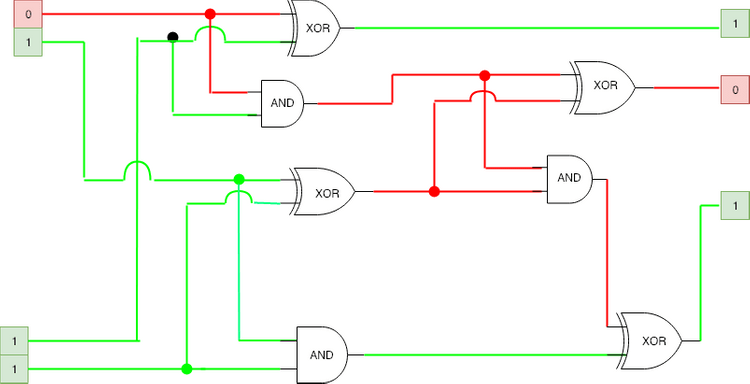
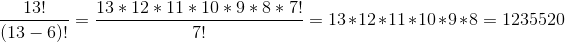
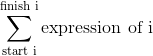
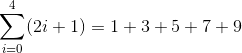
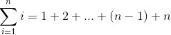
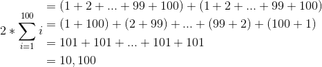
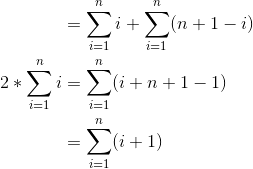
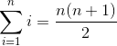
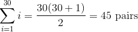
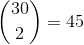

This app works best with JavaScript enabled.

# Computer Science Distilled

## Chapter One

### 1.2 Logic, 1.3 Counting && 1.4 Probability

#### 2019-01-29

### Logic in Computing

Logic gates perform logic operations on electric current. Logic gates include NOT, AND, OR, NAND, NOR, XOR, etc.

**Logic gates calculating 2 + 3 = 5 (10 + 11 = 101)**: <a href="../static/35de99570c6644b12cdf5698a7405e7a/6941e/LogicGates.png" class="gatsby-resp-image-link">    </a>

## 1.3 Counting

Both counting and logic belong in the field of _discrete mathematics_.

### Multiplying:

If one event happens _n_ ways and another _m_ ways, the way to calculate the number of ways both can happen is to multiply them.

#### Creating a PIN:

_Problem_: A PIN is comprised of two numbers and a letter. It takes one second to try a PIN. Worst case, how much time is needed to crack a PIN?

_Solution_: Two digits can be chosen 100 ways (00-99) and a possible letter in 26 ways (A-Z), making 100 \* 26 = 2600 possible PINs. Worst case would mean having to try every single combination and arriving at the right PIN on the last attempt. Since each attempt is a second and worst case is 2600 attempts, the worst case would be 2600 seconds or around 43 minutes.

#### Hiring a Team:

_Problem_: There are 23 candidates wanting to join your team. For every candidate, you flip a coin and hire if the coin lands on heads. How many team configurations are possible?

_Solution_: When you start, the only configuration is you alone working at the company. Every coin toss then doubles the number of possible configurations. Since there are 23 candidates, that would mean 223 or 8388608 configurations.

### Permutations:

If you have _n_ items, you can order them _n_ factorial (_n!_) different ways. _n! = n x (n-1) x (n-2) x...2 x 1_.

#### Traveling Salesman:

_Problem_: Truck company delivers to 15 different cities and you want to know the best order to serve the cities such that you use the least amount of gas. If it takes one microsecond to calculate the length of one route, how long does it take to compute the length of all possible routes?

_Solution_: Each permutation of the 15 cities is a different route - _15 x 14 x 13 x 12 x 11 x 10 x 9 x 8 x 7 x 6 x 5 x 4 x 3 x 2 x 1_ = ~1.3 trillion routes. In microseconds, roughly 15 days.

#### Precious Tune:

_Problem_: A musician is studying a scale of 13 notes. She wants to render all possible melodies that use six notes only. Each note should play once per melody and each six-node melody should play for a second. What would be the audio run-time for this song?

_Solution_: To count permutations of 6 out of the 13 notes, we need to ignore permutations of unused notes and stop developing the factorial after the sixth factor. _n!/(n-m)!_ is the number of possible permutations of _m_ out of _n_ possible items. <a href="../static/7c6f13042c33b35a76b08bdd967d64c2/9238b/melodies.png" class="gatsby-resp-image-link">    </a> melodies, which would take 343 hours or so.

### Permutations with Identical Items:

In a sequence of _n_ items of which _n_ are identical, there are _r!_ ways to reorder the items. So to count distinct permutations, need to divide _n!_ by the overcount factor.

Example: "COD**E** **E**N**E**RGY" would be _10!/3!_

#### Playing with DNA:

_Problem_: A biologist is studying a DNA segment relating to a specific disease. The segment is made of 23 base pairs where 9 must be A-T and 14 must be G-C. She wants to run a simulation on every possible DNA segment having this number of base pairs. How many simulations would that take?

_Solution_: First, calculate all possible permutations of the 23 base pairs then divide the result to account for the 9 repeated A-T and 14 repeated G-C base pairs:

_23!/(9! \* 14!) = 817190_ base pair mutations. But the question isn't looking for base pairs, it's looking for segments. Because there are 23 base pairs, we multiply the number of base pair mutations by 223 to get ~ 7 trillion sequences.

### Combinations:

Picture a deck of 13 cards of the same suit. How many ways can you deal six cards? The binomial <a href="../static/98ad5ad9e065a2bfca9e61008f176f1c/6deb8/binomial.png" class="gatsby-resp-image-link">    </a> is the number of ways to select _m_ items of a set of _n_ items regardless of order:  
<a href="../static/03d109b805f58194a04dc760f846fb2e/ab19c/binomial2.png" class="gatsby-resp-image-link">    </a> The binomial is read "_n_ choose _m_".

#### Chess Queens:

_Problem_: You have an empty chessboard and 8 queens which can be placed anywhere on the board - how many different ways can the queens be placed? Board has 64 squares (8x8)  
_Solution_: <a href="../static/7ec1231e9924b06149587a70fd926cd1/dbcef/chess.png" class="gatsby-resp-image-link">    </a> which equals 4426165368.

### Sums:

Sequential sums are expressed using the capital-sigma Σ notation which indicates how an expression will be summed for each value of _i_:  
<a href="../static/3cfaa2b3b5611c469f86b75a955e5419/5a94a/sum.png" class="gatsby-resp-image-link">    </a>

Summing the first five odd numbers is written:  
<a href="../static/0c8ffcf3103647523e4617a5b6ddd54d/cee2d/sumfirstfive.png" class="gatsby-resp-image-link">    </a> because the i is replaced by the numbers 0 - 4 in the equation.  
_(2(0) + 1) = 1_  
_(2(1) + 1) = 3_  
_(2(2) + 1) = 5_  
_(2(3) + 1) = 7_  
_(2(4) + 1) = 9_

Summing the first _n_ natural numbers is thus:  
<a href="../static/a70d077d1a9c64fcc479b94835fc5568/51a56/sumnatural.png" class="gatsby-resp-image-link">    </a>

#### Gauss's Trick:

Legend has it that a teacher once punished Gauss by making him sum all numbers 1 to 100 and that's what lead him to come up with this solution:

<a href="../static/2829cf1d00ce3015c3e2e948179ccc30/72413/gauss100.png" class="gatsby-resp-image-link">    </a>  
Dividing by 2 then gives the answer of 5,050.

We can formally write this as:  
<a href="../static/ac757b132db4d48903d8d0a849e6cf65/dec9c/gauss2.png" class="gatsby-resp-image-link">    </a>

As there is no _i_ in the last line, _(n+1)_ is summed over and over again _n_ times. Therefore:  
<a href="../static/3155352998c4ce52c49166dbe6c3ef63/71afe/gausstrick.png" class="gatsby-resp-image-link">    </a>

#### Flying Cheap:

_Problem_: You need to fly to New York City any time in the next 30 days. Ticket prices change unpredictably according to departure and return dates. How many pairs of days must be checked to find the cheapest tickets to fly to NYC within the next 30 days?

_Solution_: Any pair between Day 1 (today) and Day 30 is valid as long as the return flight is after the departure. So 30 pairs begin with Day 1, 29 begin with Day 2, 28 with Day 3, etc. We can use Gauss's Trick!  
<a href="../static/41a25fddf6d334b3c5d7f63fbf8cfc1a/a6b4f/flights.png" class="gatsby-resp-image-link">    </a>  
We could also solve this using combinations:  
<a href="../static/20727c1039e65c71466e7708af9bbecd/eb403/binomialflight.png" class="gatsby-resp-image-link">    </a>

## 1.4 Probability:

### Counting Outcomes:

A die roll has six possible outcomes:

⚀ ⚁ ⚂ ⚃ ⚄ ⚅ , so the chance of getting one particular number (say 4), is 1/6. The chance of rolling an odd is 3/6 or 1/2 because there are three odd dice - ⚀ ⚂ ⚄.

Probability can be calculated using this formula:  
<a href="../static/5813e1fe28172c54a3126284a2be7046/5892a/probability.png" class="gatsby-resp-image-link">    </a>

#### Team Odds

_Problem_: Given 23 candidates, throw coin and hire if heads. What are the chances of hiring nobody?

_Solution_: There is only one way to hire nobody - to throw tails 23 consecutive times. We've already established that there are 8,388,608 combinations of hiring, so the chances of hiring nobody is 1/8388608

### Independent Events:

If the outcome of an event doesn't influence the outcome of another event, they are _independent_. The probability of two independent events occurring is the product of the individual probabilities. A coin toss ending in heds is 1/2 and a die being rolled a 2 is 1/6, so the probability of both is 1/2 \* 1/6 = 1/12.

#### Backing Up:

_Problem_: You need to store data for a year. One disk has a probability of failing of one in a billion. The other disk costs 20% less and has a probability of failing of one in 2000. What should you buy?

_Solution_: If you use three cheap disks, you only lose the data if all three disks fail. The probability of that happening is (1/2000)3 -&gt; 1/8,000,000,000. That redundancy achieves a lower risk of data loss than the expensive disk while costing 60% the price.

### Mutually Exclusive Events:

When two events cannot happen simultaneously, they are _mutually exclusive_. Probability is calculated by summing the indidivual probabilities. Rolling a 4 and rolling an odd are mutually exclusive, so can be calculated by 1/6 + 1/2 = 2/3

#### Subscription Choice:

_Problem_: Your site offers a free, basic, and pro plan. Random new users have a 70% probability of choosing the free tier, 10% pro, and 20% basic. What are the chances a new user will sign up for a paying plan?

_Solution_: Customer cannot have multiple plans at the same time, so you sum the probability of both paid plans - 0.2 + 0.1 = 0.3

### Complementary Events:

When two mutually exclusive events cover all possible outcomes, they are _complementary_. The sum of individual probabilities of complementary events is 100%.

#### Tower Defense:

_Problem_: Your castle is defended by 5 towers. Each tower has a 20% chance of disabling an invader before they reach the gate. What are the chances of stopping an attacker?

_Solution_: **DO NOT SUM THE PROBABILITIES OF INDEPENDENT EVENTS**. This is an example of complementary events.

- 20% chance of a hit means 80% miss rate.
- Probability of all 5 towers missing is 0.85 which is around 0.33.
- The count of "all towers miss" is complementary to "at least one tower hits". The probability of stopping the enemy, then, is 1 - 0.33 = 0.67.

### Gambler's Fallacy:

If you flip a normal coin 10 times and get 10 heads, the 11th flip is more likely to be tails. **NEVER** assume that past events affect the outcome of an independent event.

#### Advanced Probabilities:

_Problem_: 23 candidates and the coin toss. AGAIN. What are the chances of hiring seven people or less?

_Solution_: Binomial distribution. Type _B(23, 1/2) &lt;= 7_ into Wolfram Alpha to visualize this.

References:  
_Discrete Mathematics and Its Applications_ : code.energy/rosen  
_Prof Jeanette Wing's slides on computational thinking_ : code.energy/wing

[Computer science](../tags/computer%20science/index.html)[Computer Science Distilled](../tags/computer%20science%20distilled/index.html)[Logic](../tags/logic/index.html)[Probability](../tags/probability/index.html)[Counting](../tags/counting/index.html)

### &lt;&lt; Previous: Algorithm Design Manual: How to Design Algorithms

### &gt;&gt; Next: Computer Science Distilled Complexity
